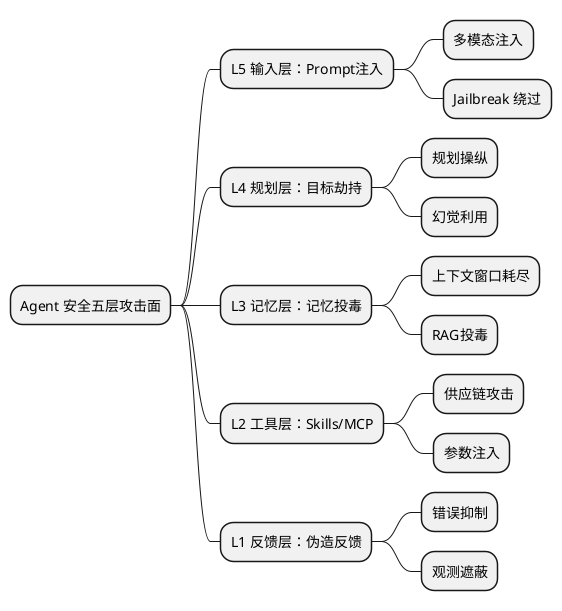

# 软件大会 Agentic Engineering & AI Coding 实战深度总结

> 2026 QCon 北京软件大会 · 两大核心议题深度解读

---

## 📋 目录

- [一、议题分类概览](#一议题分类概览)
- [二、Agentic Engineering（智能体工程）](#二agentic-engineering智能体工程)
- [三、Coding Agent 驱动的研发新范式](#三coding-agent-驱动的研发新范式)
- [四、核心价值总结](#四核心价值总结)
- [五、学习路径建议](#五学习路径建议)

---

## 一、议题分类概览

本次大会的16个演讲可划分为两大类别：

| 类别 | 主题聚焦 | 核心命题 | 涉及演讲数 |
|------|----------|----------|-------------|
| **Agentic Engineering** | 自主智能体架构、安全、企业级应用 | AI Native 时代，智能体如何成为新型软件入口 | 8 |
| **Coding Agent 驱动研发新范式** | AI 赋能软件研发的工程化实践 | 从 PRD 到上线的完整闭环，如何用 AI 重塑研发流程 | 8 |

### 分类边界说明

```
┌─────────────────────────────────────────────────────────────────┐
│                    Agentic Engineering                          │
│  (智能体本身: 架构、设计、安全、应用形态)                          │
├─────────────────────────────────────────────────────────────────┤
│  · 自主系统的时代 (黄东旭)                                       │
│  · 智能体安全与防御 (Sunny Duan)                                 │
│  · 智能革命时代的安全范式 (韦韬)                                 │
│  · 多模态+Agent教育 (尹辰轩)                                     │
│  · AIOps运维场景 (马云雷)                                        │
│  · 企业级OpenClaw实践 (陈彪)                                     │
│  · DeepResearch+OpenClaw (卢亿雷)                               │
│  · 蚂蚁Vibe Coding (彭佩乔)                                       │
└─────────────────────────────────────────────────────────────────┘

┌─────────────────────────────────────────────────────────────────┐
│              Coding Agent 驱动的研发新范式                       │
│  (如何用AI重塑研发: 流程、工具、人员组织)                          │
├─────────────────────────────────────────────────────────────────┤
│  · AI Coding 全栈实战 (邓立山)                                   │
│  · PRD到上线的闭环 (李文鹏)                                       │
│  · JoyCode企业实践 (徐翔)                                        │
│  · Feedback Loop飞轮 (牛万鹏)                                    │
│  · 液态超级团队 (徐文健)                                         │
│  · 超级团队进行时 (黄闻欣)                                       │
│  · 企业AI应用分水岭 (赵钰莹)                                      │
└─────────────────────────────────────────────────────────────────┘
```

---

## 二、Agentic Engineering（智能体工程）

### 2.1 核心观点：载体级别的变革

**黄东旭（PingCAP）** 在《自主系统的时代》中提出：

> 这次是**载体级别**的变革。代码第一次从**思考载体**变成了**执行载体**。

```
传统范式 (代码时代)
────────────────────────────────────────────────
  人类 → 编程语言 → 代码 → 编译器 → 执行
         ↑ 思考载体   ↑ 工具
         
AI 时代 (Agent时代)
────────────────────────────────────────────────
  人类 → 目标 + 上下文 → Agent → 执行
                      ↑ 新的思考/执行载体
```

**核心理念**：
- **模型 = CPU**，**Agent = OS**，**Skills = App**
- 不需要自己造 CPU 和 OS，只需要写好 App
- 人的领域经验 = Skills 的原料

---

### 2.2 软件形态的变迁

| 维度 | 传统软件 | Agent-Native 软件 |
|------|----------|-------------------|
| **入口** | GUI/浏览器 | IM/自然语言 |
| **形态** | 静态的、固化的 | 动态生成、按需组合 |
| **核心接口** | UI/功能按钮 | "意图"才是接口 |
| **设计哲学** | 确定性优先 | 自主性优先 |

**UNIX 哲学复兴**：古老的 CLI 在 Agent 时代重新焕发活力，因为 Agent 可以通过组合工具完成复杂任务。

---

### 2.3 安全范式重塑

**Sunny Duan（京东安全）** 提出 **Agent 安全五层攻击面模型**：



**AI Native 防御架构**：

| 层级 | 防御手段 |
|------|----------|
| 输入层 | 规则引擎 + AI检测 |
| 规划层 | 意图提取 + 计划验证 |
| 记忆层 | 投毒检测 + 时效性管理 |
| 工具层 | 静态扫描 + 权限控制 |
| 反馈层 | 异常行为监测 + 纠错验证 |

---

### 2.4 企业级落地实践

#### ZillizTown：基于 Milvus 与 Claude Code 打造企业版 OpenClaw

**陈彪（Zilliz）** 展示的四个真实场景：

```
┌────────────────────────────────────────────────────────────────┐
│ 场景1：飞书里的日常对话                                      │
│ • Avatar 住在飞书里(IM入口)                                 │
│ • 主会话 = 持久对话空间                                     │
│ • 话题 = 独立 Session，并行不串扰                          │
│ • --resume 跨重启恢复上下文                                  │
├────────────────────────────────────────────────────────────────┤
│ 场景2：Agent 自己醒来巡检                                    │
│ • Agent 自设 Cron 闹钟                                      │
│ • 带着完整上下文醒来自主判断                                 │
│ • 独立 Session，不阻塞主会话                               │
├────────────────────────────────────────────────────────────────┤
│ 场景3：Avatar 找 Avatar 帮忙                               │
│ • 经过 Hub 路由，按 Skills 找对的 Avatar                   │
│ • send_message 同步 / create_task 异步                    │
│ • 对方自主判断接受/拒绝                                    │
├────────────────────────────────────────────────────────────────┤
│ 场景4：在飞书里训练 Avatar                                  │
│ • 对话就是训练，纠正偏好、分享经验                          │
│ • Avatar 自主决定记什么                                    │
│ • 记忆 + Skills + 工具，三位一体                            │
└────────────────────────────────────────────────────────────────┘
```

**六个核心技术要素**：

| 要素 | 说明 | 类比 |
|------|------|------|
| Context Window | 单次推理的工作记忆上限 | 工作台大小 |
| System Prompt | 定义 Agent 的身份、角色、行为规则 | 宪法 |
| Skills | 领域知识包，按需加载用完释放 | App |
| MCP | 连接外部系统的标准协议 | USB 接口 |
| Memory | 跨会话的持久化信息 | 硬盘 |
| Sub-agent | 委派子任务给独立 Agent | 子线程 |

---

#### DeepResearch X OpenClaw

**卢亿雷（白海科技）** 展示的实现路径：

```
需求分析 ──→ 研究规划 ───→ 深度研究与报告
    │           │              │
    ▼           ▼              ▼
意图识别     自动生成计划     循环检索分析
需求澄清     用户确认      增量内容输出
报告预判     搜索策略    多格式报告生成
```

**Token 成本优化全景**：

| 优化手段 | 层级 | 效果 |
|---------|------|------|
| 语义缓存 | 请求前 | 命中则跳过 LLM 调用 |
| Prompt Cache | 请求前 | API 原生缓存减少重复计费 |
| 模型路由 | 请求中 | 规划用强模型，摘要用轻量模型 |
| 输入压缩 | 请求中 | 滑动窗口+历史摘要替代全文 |
| Output 精确控制 | 响应 | 中间轮次只要结构化摘要 |
| 研究轮次收敛 | 流程 | 无显著新信息时提前终止 |

---

### 2.5 行业趋势判断

**韦韬博士** 的核心洞察：

```
2023: 人 → 对话 → AI
2024: 人 → 指令 → Agent → 工具
2025: 人 → 目标 → 多Agent协作 → 多工具链
2026+: 人 → 意图 → Agent网络 → 自主决策 → 持续运行+交付
```

**赵钰莹（极客邦科技）** 总结的分水岭：

- 从**试点热潮**到**规模落地**的真实分水岭
- 已经进入**超级智能体时代**

---

## 三、Coding Agent 驱动的研发新范式

### 3.1 核心命题：为什么 AI 编码"总差点意思"

**邓立山（淘宝闪购）** 提出：

> AI 有幻觉、知识固化、不了解需求——这是 AI 编码的天然短板

**问题本质**：

```
AI 编码的困境
─────────────────────────────────────────────────────
• 幻觉天性  →  AI 会编造不存在的 API
• 知识固化  →  训练数据有时效性
• 需求不确定 →  自然语言需求难以精确理解
• 工程缺失  →  缺少保障机制
```

**范式演进**：

```
智能补全 → Agent → Spec Driven → Harness Driven
(辅助驾驶)  (自动驾驶)  (规范驾驶)   (可控自动驾驶)
    │          │           │            │
    ▼          ▼           ▼            ▼
Copilot     Claude      OpenSpec     百度 Comate
            Code        Spec-Kit    飞轮模式
```

---

### 3.2 三位一体 AI 编码方案

**邓立山** 提出的 **Rules + Spec + Skills** 方案：

```plantuml
graph TD
    subgraph "Rules（最高宪法）"
        R1[目录结构约束]
        R2[架构模式约束]
        R3[技术栈约束]
    end
    
    subgraph "Spec（一般法律）"
        S1[需求分析规范]
        S2[编码规范]
        S3[测试规范]
    end
    
    subgraph "Skills（执法机构）"
        SK1[自动路由]
        SK2[工作流编排]
        SK3[质量检查]
    end
    
    R1 --> SK1
    R2 --> SK2
    S1 --> SK1
    S2 --> SK2
    S3 --> SK3
```

**Rules 保障架构不偏离**：
- 目录结构、架构模式、技术栈等应用维度的关键设计

**Spec 保障各环节质量**：
- 需求分析应该遵守什么规范
- 编写代码应该遵守什么原则

**Skills 让整套方案自动运转**：
- 自动识别用户意图，动态路由到不同场景

---

### 3.3 从 PRD 到上线的交付闭环

**李文鹏（好未来）** 的 SOP 六阶段实践：

```
Release
   ▲
OnBoard ─────────────────┐
   ▲                  │
Design               │
   ▲                  │ 基座闭环
Spec Review          │
   ▲                  ▼
Design & Plan        Base
   ▲                  │
Implement ──────────► │
                     ▼
                 实现 + 测试
```

**核心解法**：
- **MVP 文档基座 + 自然生长**：成本低→不改工作方式→团队顺手就用
- **Spec 不是文档，是需求契约**：流程改造为 Spec Review（产研测共识）

**Hybrid Execution Protocol**：

```
Agent 总成本 = 准备成本 + 验证成本 + 返工风险

缺口门禁：Agent 执行前的自检
• 把"AI 乱写一通再人工返工"
• 变成"先确认再动手"

AI 提的 PR：
• 审核时间是人的 4.6 倍
• 平均打回轮次：3 → 1.5
• 公共模块变更导致的线上 bug 数：0
```

---

### 3.4 构建 Coding Agent 的飞轮

**牛万鹏（百度 Comate）** 的三要素：

#### Feedback Loop：让 Agent 的行为可观测

| 观测维度 | 核心指标 |
|----------|----------|
| 工具调用 | Query和Tool Call比例、Tool执行时长 |
| 上下文 | Skills的Tokens消耗、Memory触发比例 |
| 执行结果 | 单Query更改文件数量 |
| 执行轨迹 | Debug类任务的执行路径 |

**实践发现**：
- 使用 Skills 的方式实现 MCP 动态加载，节省 **98%** 的 Tokens 消耗
- GPT 系列模型偏好用 Bash 工具检索/编辑/读取，而非专用工具

#### Benchmark：挖掘评测集和发现异常

```
四象限分析
─────────────────────────────────────────────────────
Y轴 ↑  Execution（执行效率 40%）
   │
   │    ┌──────────┤──────────┐
   │    │  正常   │ 需要关注  │
   │    ├──────────┼──────────┤
   │    │  低效   │  异常   │
   │    └──────────┴──────────┘
   └──────────────────────────────→ X轴
                   Outcome（结果质量 60%）
```

#### Agent Engineers：把人放到 Loop 里

**两层含义**：
1. **全员转型**：每个人都成为 Agent Engineer，角色边界正在消失
2. **人也是 Tool**：人提供的判断、审美、业务知识是 Agent 无法生成的 Context

---

### 3.5 企业级 AI Coding 实践

#### JoyCode：企业级 AI Coding 实践

**徐翔（京东科技）** 的方案：

```
┌────────────────────────────────────────────────────────┐
│ 企业在编码场景的核心挑战                              │
├────────────────────────────────────────────────────────┤
│ 1. 超大代码仓 → 上下文爆炸                      │
│ 2. 用户画像丰富 → 期望差异大                   │
│ 3. 复杂长任务 → 多模块跨系统                   │
└────────────────────────────────────────────────────────┘
           ▼
┌────────────────────────────────────────────────────────┐
│ JoyCode 解决思路：Context Engineering              │
├────────────────────────────────────────────────────────┤
│ 1. 代码图索引 → 项目复杂度分析、调用链分析          │
│ 2. 多路检索 → grep/语义/倒排/Wiki             │
│ 3. 企业知识增强 → CodeWiki + 设计稿              │
└────────────────────────────────────────────────────────┘
```

**检索策略对比**：

| 检索方式 | 优势 | 劣势 |
|----------|------|------|
| grep_search | 精确性高、正则灵活 | 无语义理解 |
| embedding_search | 智能理解、模糊查询 | 需要索引 |
| wiki_search | 专注文档、结构化 | 不搜索代码 |
| inverted_index | 响应快、灵活匹配 | 无语义理解 |
| term_parse_search | 结果准确、相关性排序 | 依赖关键词提取 |

#### 蚂蚁 Vibe Coding 平台

**彭佩乔（蚂蚁集团）** 的实践：

```
平台能力演进
─────────────────────────────────────────────────��─��
Q1   → Q2   → Q3   → Q4
     │      │      │
Tokens消耗  超长轮次  巨型项目  数据库
  极快      变傻     卡顿     门槛高
     │      │      │
缓存命中    Memory   文件图   自动SQL
 80%+     压缩    索引    生成
```

**架构跃迁**：

```
旧架构                         新架构
─────────────────────────────────────────────────────
Workflow 驱动              Skills 化自主决策
预置最佳实践                AI 自行决策加载/卸载
编码索引                    语义索引 + 记忆召回
单一 Session               超大工程管理
```

---

### 3.6 液态超级团队

**徐文健（ColaOS）** 的核心理念：

> **杀死"流水线"**：20人团队，一年，组织方式两次变革升级，10倍产出效率提升

```
传统研发模式                    AI Native 模式
──────────────────────────────────────────────────
人 → 需求 → 排期 → 开发 → 测试 → 发布
                │
                ▼ 从"人找事"到"事找人"
人 → 目标 → Agent → 自主执行 → 持续交付
```

**关键转变**：
- 不靠加人加班
- 靠组织方式变革
- 从"人找事"到"事找人"

---

### 3.7 AI 编码指标实证

**邓立山** 的数据：

| 指标 | 提升前 | 提升后 | 提升幅度 |
|------|--------|--------|---------|
| AI编码率 | 9.6% | 89.2% | **9倍+** |
| Bug率 | - | <0.2% | <0.3% |
| 发布回滚率 | - | <2% | - |

**牛万鹏** 的数据：
- 人均 Query 次数增长 **5倍**
- Comate IDE 唤起时长占所有 IDE 的 **60%+**

---

## 四、核心价值总结

### 4.1 两大类别的边界与差异

| 维度 | Agentic Engineering | Coding Agent 驱动研发 |
|------|----------------|-----------------|
| **焦点** | 智能体本身的设计与运行 | 用智能体重塑研发流程 |
| **问题** | 如何构建可靠的 AI Agent | 如何用 AI 提升研发效能 |
| **关键** | 架构、安全、入口迁移 | 规范、闭环、飞轮 |
| **阶段** | 产品层/基础设施层 | 应用层/工程层 |

### 4.2 可以汲取的核心价值

#### 1. 范式转变认知

```
┌─────────────────────────────────────────────────────────────────┐
│ 핵心 insight：                                          │
│                                                         │
│  • 代码 = 工具 → 代码 = 执行载体（黄东旭）               │
│  • AI 不是银弹，是超级杠杆（邓立山）                   │
│  • 引擎越强，方向盘越重要（牛万鹏）                       │
│  • 2026 从「试点热潮」到「规模落地」分水岭             │
└─────────────────────────────────────────────────────────────────┘
```

#### 2. 工程实践方法论

| 方法论 | 代表演讲 | 核心要点 |
|--------|---------|----------|
| 三位一体编码 | 邓立山 | Rules + Spec + Skills |
| 六阶段 SOP | 李文鹏 | 基座闭环 + Hybrid Execution |
| 飞轮模式 | 牛万鹏 | Feedback Loop + Benchmark + Agent Engineers |
| 五层安全 | Sunny Duan | 输入→规划→记忆→工具→反馈 |

#### 3. 技术选型参考

| 场景 | 推荐方案 |
|------|----------|
| 企业级 Agent 入口 | ZillizTown（飞书 IM 接入） |
| 深度研究 | DeepResearch + OpenClaw |
| AI Coding | Rules+Spec+Skills 方案 |
| 大型代码仓 | 代码图索引 + 多���检索 |
| Agent 评测 | Git Blame 挖掘评测集 + 四象限分析 |

#### 4. 关键数据参考

- AI 编码率：9.6% → 89.2%（9倍+）
- Tokens 缓存命中率：80%+
- MCP 动态加载节省：98%
- PR 审核效率提升：4.6倍
- 产出效率提升：10倍

### 4.3 未来趋势判断

```
趋势判断
────────────────────────────────────────────────────
2026 关键趋势
│
├── 入口迁移：GUI → IM → 自然语言
│
├── 角色消失：全员 Agent Engineer
│   • 研发 → 产品 → 测试 → 运营都在用 Agent
│   • 协作模式从"分task"到"一人+agent"
│
├── 交付变革：
│   • 代码即规范，规范即代码
│   • 从"写完"到"能用"的距离压缩为零
│   • 交付物 = 代码 + 决策档案 + 质量证据
│
└── 基础设施：
    • AI Native Infra 崛起
    • Token = 流量 = 基础设施
    • 机器驱动 vs 人类驱动
```

---

## 五、学习路径建议

### 5.1 入门路径

```
学习路径
─────────────────────────────────────────────────────
Step 1: 概念建立
  ↓
  《黄东旭-自主系统的时代》
  《韦韬-智能革命时代》
  
Step 2: 工程方法
  ↓
  《邓立山-AI Coding全栈实战》
  《李文鹏-PRD到上线闭环》
  
Step 3: 实践参考
  ↓
  《牛万鹏-飞轮模式》
  《徐翔-JoyCode》
  
Step 4: 深度专题
  ↓
  《Sunny Duan-Agent安全》
  《陈彪-ZillizTown》
```

### 5.2 按需查阅

| 如果你想 | 建议阅读 |
|----------|----------|
| 理解 AI 时代的范式转变 | 黄东旭、韦韬 |
| 构建企业级 Coding Agent | 邓立山、徐翔、牛万鹏 |
| 搭建 Agent 安全体系 | Sunny Duan |
| 实现 Agent 平台落地 | 陈彪、彭佩乔 |
| 优化 Agent 成本 | 卢亿雷 |
| 重塑研发组织方式 | 徐文健、黄闻欣 |

---

## 📚 参考演讲清单

### Agentic Engineering（8个）

| 演讲 | 嘉宾 | 公司 | 核心关键词 |
|------|------|------|------------|
| 自主系统的时代 | 黄东旭 | PingCAP | 载体变革、Skills生态 |
| 智能革命时代 | 韦韬博士 | / | 安全范式、AI Native |
| 智能体安全 | Sunny Duan | 京东安全 | 五层攻击面、防御架构 |
| DeepResearch X OpenClaw | 卢亿雷 | 白海科技 | Token成本、平台化 |
| ZillizTown | 陈彪 | Zilliz | 企业级OpenClaw、A2A |
| AIOps Agent | 马云雷 | 阿里云 | 运维场景、数据飞轮 |
| 多模态+Agent | 尹辰轩 | 北银金科 | 教育场景 |
| Vibe Coding | 彭佩乔 | 蚂蚁集团 | 全员Agent |

### Coding Agent 驱动研发（8个）

| 演讲 | 嘉宾 | 公司 | 核心关键词 |
|------|------|------|------------|
| AI Coding全栈实战 | 邓立山 | 淘宝闪购 | 三位一体、可复制 |
| PRD到上线闭环 | 李文鹏 | 好未来 | Hybrid Execution |
| JoyCode | 徐翔 | 京东科技 | 上下文工程 |
| 飞轮 | 牛万鹏 | 百度 | Feedback Loop |
| 液态团队 | 徐文健 | ColaOS | 组织变革 |
| 超级团队 | 黄闻欣 | / | AI自驱 |
| 企业AI分水岭 | 赵钰莹 | 极客邦 | 规模落地 |

---

> **总结**：2026软件大会传递的核心信息是——AI Agent 正在从"对话助手"变成"自主执行者"，软件工程的范式正在发生根本性转变。从"如何写代码"转向"如何设计 AI 工作环境"，从"人找事"转向"事找人"，从"试点热潮"转向"规模落地"。掌握这些方法论，是在 AI 时代保持竞争力的关键。